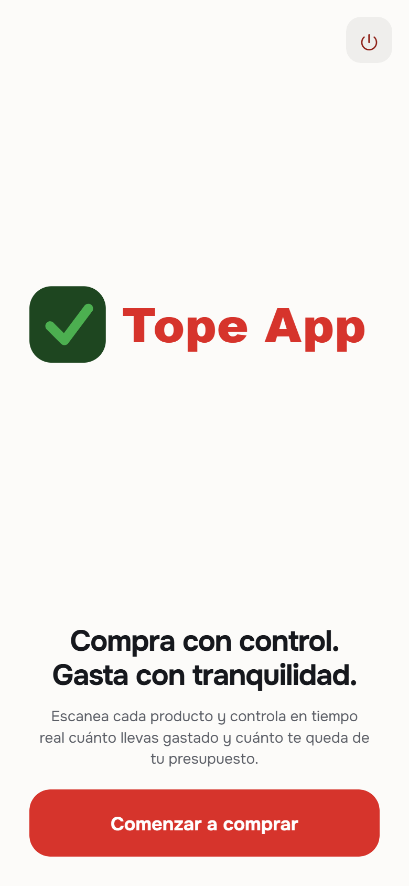
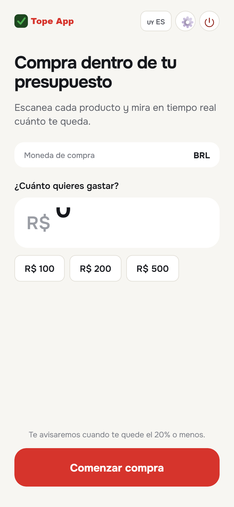
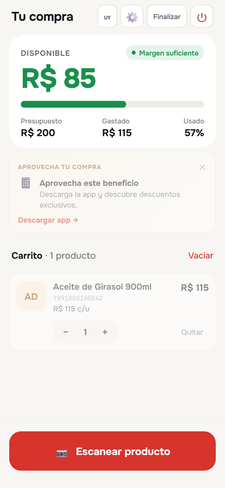
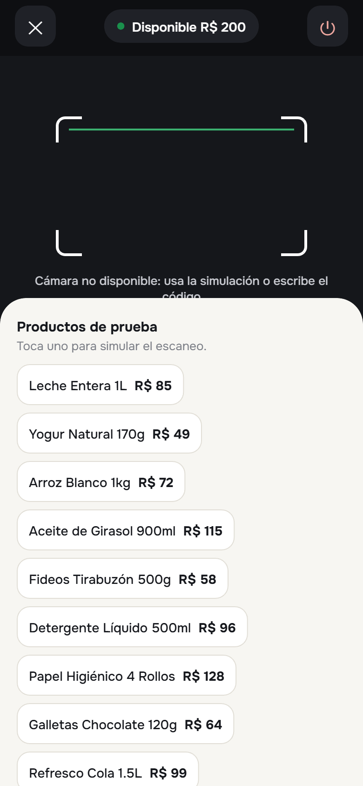
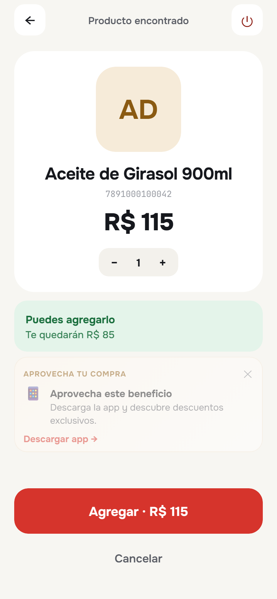
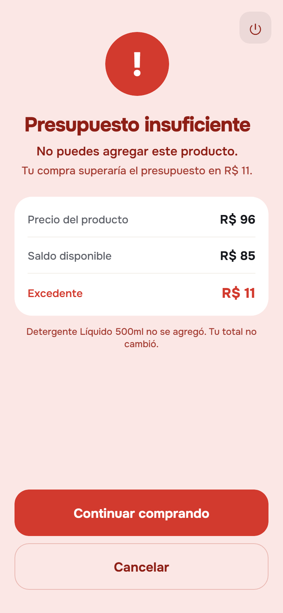
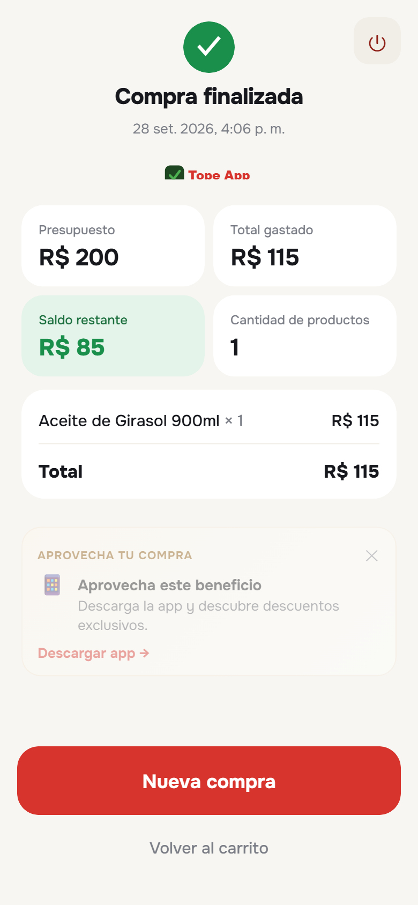

# 🛒 Tope App

### Control inteligente de presupuesto para compras en tiempo real

[](https://jvs191.github.io/tope-app/)
[](LICENSE)
[](https://developer.mozilla.org/en-US/docs/Web/HTML)
[](https://developer.mozilla.org/en-US/docs/Web/CSS)
[](https://developer.mozilla.org/en-US/docs/Web/JavaScript)
[](#-experiencia-multidispositivo)

---

## 🚀 Demo

### 👉 [PROBAR TOPE APP](https://jvs191.github.io/tope-app/)

**Tope App** es un prototipo funcional de una aplicación de control de presupuesto para compras.

El usuario define cuánto desea gastar y la aplicación controla cada producto agregado a la compra en tiempo real.

Si un nuevo producto hace que el total supere el presupuesto disponible, la aplicación lo rechaza automáticamente.

> **Compra con un límite. Controla tu gasto. Evita sorpresas.**

---

## 💡 ¿Qué problema resuelve?

Durante una compra, es fácil perder la noción de cuánto se ha gastado.

Tope App transforma el presupuesto disponible en una regla activa durante todo el proceso de compra.

### Flujo principal

```text
💰 Define tu presupuesto
        ↓
🛒 Agrega productos
        ↓
📊 Tope calcula el total
        ↓
⚠️ Verifica el límite
        ↓
✅ Dentro del presupuesto
        │
        └── ❌ Supera el límite → Producto rechazado
```

El objetivo es ofrecer una experiencia sencilla para que el consumidor pueda saber en todo momento:

* cuánto tiene disponible;
* cuánto lleva gastado;
* cuánto puede seguir gastando;
* qué producto hizo que superara el límite.

---

# ✨ Características principales

## 💰 Control de presupuesto

El usuario establece un presupuesto inicial y la aplicación controla automáticamente el importe disponible.

La regla principal es:

```text
TOTAL ACTUAL + PRECIO DEL PRODUCTO
                    ≤
             PRESUPUESTO
```

Si la operación supera el límite:

```text
❌ PRODUCTO RECHAZADO

Este producto supera
tu presupuesto disponible.
```

---

## 📷 Escáner de productos

Tope App incorpora lectura de códigos de barras mediante la API `BarcodeDetector`, cuando el navegador/dispositivo es compatible.

También dispone de alternativas para entornos donde la cámara no está disponible:

* productos de demostración;
* carga manual mediante código;
* incorporación manual al carrito.

---

## 🌎 Multidioma

La aplicación contempla:

🇪🇸 Español — Uruguay

🇧🇷 Português — Brasil

La estructura permite ampliar posteriormente el sistema a otros idiomas.

---

## 💱 Multimoneda

Actualmente contempla:

🇺🇾 UYU — Peso uruguayo

🇧🇷 BRL — Real brasileño

🇺🇸 USD — Dólar estadounidense

Esto permite utilizar el concepto en mercados donde existe interacción comercial entre diferentes monedas.

---

## 🛍️ Carrito de compra

El usuario puede visualizar:

* productos agregados;
* cantidades;
* precio individual;
* subtotal;
* total;
* presupuesto;
* saldo disponible.

---

## 🔔 Alertas

El sistema puede proporcionar feedback mediante:

* alertas visuales;
* sonido de confirmación;
* vibración compatible;
* mensajes de rechazo;
* confirmación de productos.

---

## ↩️ Deshacer acciones

Las acciones de compra pueden ser revertidas para facilitar la interacción durante la construcción del carrito.

---

## 💾 Persistencia local

Las preferencias del usuario pueden mantenerse mediante:

```text
localStorage
```

Esto permite conservar determinadas configuraciones entre sesiones sin necesidad de un backend.

---

# 🎯 "Aprovecha tu compra"

Tope App incluye un espacio preparado para contenido comercial.

Este módulo puede utilizarse para mostrar:

* 🏷️ promociones;
* 🎟️ cupones;
* ⭐ beneficios;
* 💳 programas de fidelización;
* 🛒 productos relacionados;
* 📢 campañas comerciales;
* 🎁 beneficios especiales.

El contenido puede configurarse mediante prioridad y vigencia.

Además, el módulo puede desactivarse desde los ajustes de la aplicación.

---

# 📱 Experiencia multidispositivo

La interfaz está diseñada para adaptarse a diferentes tamaños de pantalla:

* 📱 teléfonos pequeños;
* 📱 teléfonos estándar;
* 📱 teléfonos grandes;
* 📲 tablets;
* ↕️ orientación vertical;
* ↔️ orientación horizontal.

El objetivo es mantener una experiencia consistente independientemente del dispositivo utilizado.

---

# 🖼️ Capturas

## Pantallas principales

| Bienvenida | Inicio | Compra |
| --- | --- | --- |
|  |  |  |

## Flujo de compra

| Escáner | Resultado | Alerta | Resumen |
| --- | --- | --- | --- |
|  |  |  |  |

---

# 🧩 Arquitectura

Tope App está construido deliberadamente sin frameworks ni dependencias externas.

```text
┌──────────────────────────────────────┐
│              TOPE APP                │
├──────────────────────────────────────┤
│                                      │
│           index.html                 │
│       Estructura / Pantallas         │
│                 │                    │
│                 ▼                    │
│             style.css                │
│       Diseño / Responsive             │
│                 │                    │
│                 ▼                    │
│              app.js                  │
│                                      │
│   ┌──────────────────────────────┐   │
│   │ Estado de la aplicación      │   │
│   │ Motor de presupuesto         │   │
│   │ Catálogo                     │   │
│   │ Carrito                      │   │
│   │ Eventos                      │   │
│   │ Renderizado                  │   │
│   │ Beneficios comerciales       │   │
│   └──────────────────────────────┘   │
│                                      │
│                 │                    │
│                 ▼                    │
│              assets/                 │
│        Recursos multimedia           │
│                                      │
└──────────────────────────────────────┘
```

### Estructura del proyecto

```text
tope-app/
│
├── assets/
│   └── ...
│
├── screenshots/
│   └── ...
│
├── .gitignore
├── LICENSE
├── README.md
├── index.html
├── style.css
└── app.js
```

---

# ⚙️ Tecnologías

| Tecnología | Uso |
| --- | --- |
| HTML5 | Estructura de la aplicación |
| CSS3 | Diseño y responsive |
| JavaScript | Lógica y comportamiento |
| BarcodeDetector API | Lectura de códigos |
| LocalStorage | Persistencia local |
| GitHub Pages | Demo pública |

### Sin frameworks

Tope App funciona con:

```text
HTML
CSS
JavaScript
```

sin necesidad de:

* React;
* Vue;
* Angular;
* Node.js;
* bundlers;
* base de datos;
* backend.

Esto facilita la ejecución, demostración y adaptación del prototipo.

---

# 🧠 Separación de lógica y datos

El catálogo de productos y el contenido comercial están estructurados como datos dentro de `app.js`.

Por ejemplo:

```javascript
CATALOG
```

y

```javascript
BENEFICIOS
```

pueden evolucionar posteriormente hacia fuentes externas como:

```text
API
 ↓
Base de datos
 ↓
ERP
 ↓
POS
 ↓
Catálogo del supermercado
```

sin necesidad de reconstruir completamente la interfaz.

---

# 🏗️ Evolución hacia una solución empresarial

Tope App actualmente funciona como un prototipo frontend independiente.

Su arquitectura permite plantear una evolución hacia una plataforma conectada.

### Evolución posible

```text
TOPE APP
   │
   ├── API de productos
   │
   ├── Base de datos
   │
   ├── Catálogo comercial
   │
   ├── Sistema POS
   │
   ├── ERP
   │
   ├── CRM
   │
   ├── Programa de fidelización
   │
   ├── Cupones
   │
   ├── Promociones
   │
   ├── Analytics
   │
   ├── WhatsApp
   │
   └── Inteligencia Artificial
```

---

# 🏢 Casos de uso comerciales

Tope App puede utilizarse como base conceptual para diferentes soluciones digitales.

### 🛒 Supermercados

Aplicación para que los clientes controlen su presupuesto mientras realizan sus compras.

### 🏪 Retail

Control de presupuesto integrado con catálogo y promociones.

### 🎟️ Fidelización

Mostrar beneficios personalizados durante el proceso de compra.

### 📢 Promociones

Presentar ofertas, cupones y campañas comerciales dentro de la experiencia digital.

### 📱 Aplicaciones de clientes

Utilizar la misma lógica como componente de una aplicación móvil o PWA.

### 💳 Experiencias de compra

Integrar presupuesto, catálogo, promociones y fidelización en una única experiencia.

---

# 🔮 Roadmap

El proyecto está planteado como una base sobre la cual pueden construirse futuras funcionalidades.

## Fase 1 — Prototipo

* [x] Control de presupuesto
* [x] Carrito
* [x] Catálogo de demostración
* [x] Escáner
* [x] Entrada manual
* [x] Multimoneda
* [x] Español
* [x] Português
* [x] Responsive
* [x] Alertas
* [x] Persistencia local
* [x] Bloque de beneficios comerciales

## Fase 2 — Producto conectado

* [ ] Backend
* [ ] Base de datos
* [ ] Catálogo dinámico
* [ ] API de productos
* [ ] Cuenta de usuario
* [ ] Historial de compras
* [ ] Sincronización entre dispositivos

## Fase 3 — Retail

* [ ] Integración con inventario
* [ ] Integración con POS
* [ ] Promociones en tiempo real
* [ ] Cupones digitales
* [ ] Programa de fidelización
* [ ] Perfil de cliente
* [ ] Analytics

## Fase 4 — Inteligencia

* [ ] Recomendaciones personalizadas
* [ ] Asistente de compra con IA
* [ ] Análisis de hábitos
* [ ] Alertas inteligentes
* [ ] Recomendaciones según presupuesto
* [ ] Integración con WhatsApp

> El roadmap es orientativo y no representa funcionalidades actualmente disponibles.

---

# 🧪 Cómo probar Tope App

Puedes probar la aplicación directamente desde la demo:

### 👉 [Abrir Tope App](https://jvs191.github.io/tope-app/)

También puedes descargar/clonar el repositorio:

```bash
git clone https://github.com/jvs191/tope-app.git
```

Entrar en la carpeta:

```bash
cd tope-app
```

Y abrir el proyecto mediante cualquier servidor estático.

También puede abrirse directamente en un navegador para probar la mayoría de las funciones.

### Cámara

Para utilizar el escáner mediante cámara, el navegador requiere un contexto seguro:

```text
HTTPS
```

o:

```text
localhost
```

El acceso a la cámara puede estar bloqueado cuando la aplicación se ejecuta mediante:

```text
file://
```

---

# ⚠️ Limitaciones conocidas

### iOS Safari

La API `BarcodeDetector` no está disponible en determinadas versiones/entornos de Safari.

En esos casos se mantienen disponibles:

* productos de demostración;
* entrada manual;
* interacción táctil.

### Catálogo

Los productos incluidos actualmente son datos de demostración.

### Beneficios comerciales

El contenido del módulo "Aprovecha tu compra" es demostrativo y está preparado para evolucionar hacia una fuente de datos real.

---

# 🔐 Privacidad

La versión actual funciona principalmente de forma local y no requiere una cuenta de usuario ni un backend para ejecutar el flujo principal.

No se deben incorporar claves API, contraseñas, tokens, credenciales ni información sensible al repositorio.

---

# 🤝 Contribuciones

Las ideas, mejoras y sugerencias son bienvenidas.

Si quieres proponer una mejora:

1. Crea un Issue.
2. Describe el problema o funcionalidad.
3. Explica el comportamiento esperado.
4. Si corresponde, crea un Pull Request.

---

# 📄 Licencia

Este proyecto se distribuye bajo licencia **MIT**.

Consulta el archivo [`LICENSE`](LICENSE) para conocer los términos completos.

---

# 🚀 Desarrollado por Veitia Studios

<p align="center">
  
</p>

**Tope App** forma parte del laboratorio de productos y soluciones digitales de:

## VEITIA STUDIOS

### Soluciones visuales que impulsan resultados reales.

Desarrollamos soluciones digitales utilizando:

* 🤖 Inteligencia Artificial
* ⚙️ Automatización
* 📱 Aplicaciones y PWA
* 🌐 Sitios web
* 🛒 Soluciones para retail
* 🍽️ Tecnología para restaurantes
* 📊 Sistemas de gestión
* 🔗 Integraciones
* 💬 Agentes de IA para WhatsApp
* 🚀 Productos SaaS

---

### ¿Tienes una idea para tu negocio?

Podemos transformar una idea, proceso o problema empresarial en una solución digital.

**Desde un prototipo hasta una plataforma empresarial.**

### 🌐 Veitia Studios

👉 **https://veitiastudios.com**

### 💬 Hablemos sobre tu proyecto

Si quieres desarrollar una aplicación, automatización, PWA, sistema empresarial o solución basada en IA, contacta con Veitia Studios.

---

## ⭐ Si este proyecto te resulta útil

Puedes darle una ⭐ al repositorio y seguir su evolución.

---

### Tope App

**Controla tu presupuesto.
Controla tu compra.**

**Developed with technology by Veitia Studios.**

---

© 2026 Veitia Studios
